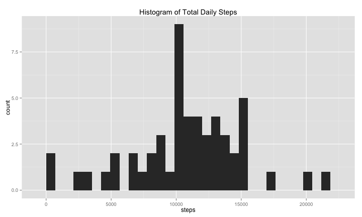
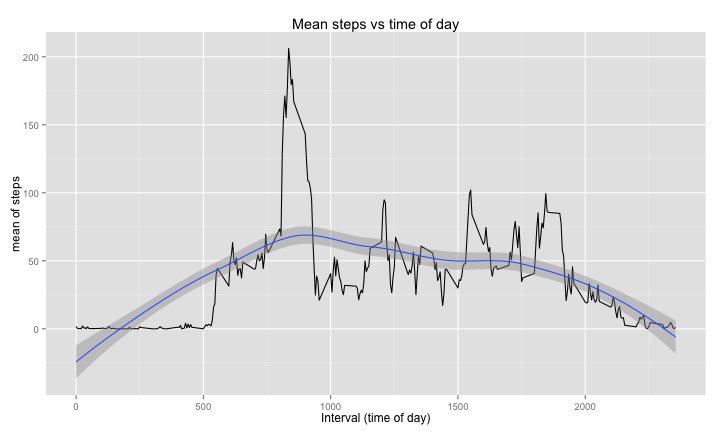
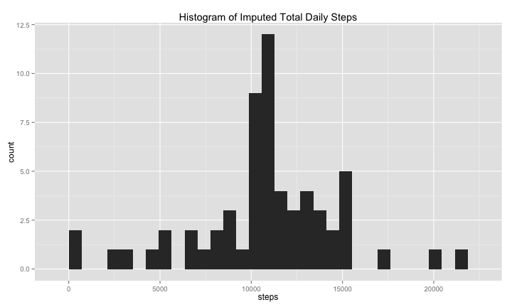
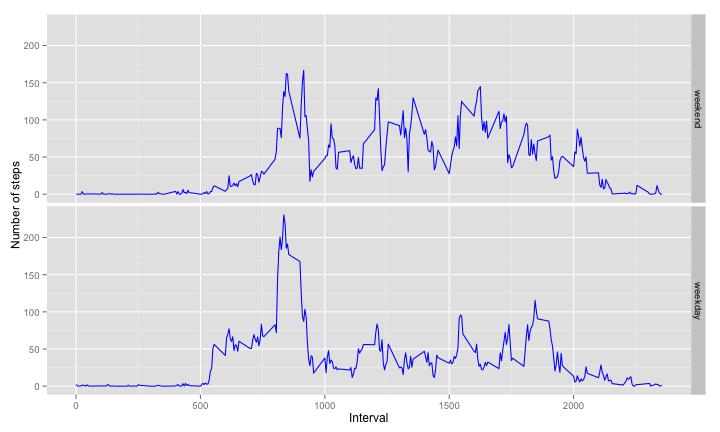

# Peer Assessment 1: Fitness Tracking Record
## Required packages

```
## Loading required package: ggplot2
## Loading required package: lubridate
## Loading required package: plyr
## 
## Attaching package: 'plyr'
## 
## The following object is masked from 'package:lubridate':
## 
##     here
## 
## Loading required package: stringr
```

## Loading and preprocessing of data
1. Read the data from the `activity.csv` file in the working directory.
- The data importation **does not exclude missing (NA) values**.
- The interval field contains time information in integer format; for example 5:30 AM is represented as 530.
- The script combines `date` and `interval` to a single POSIXct field called `timestamp`.
- Any superfluous fields are discarded.

```r
setClass("ymd")  #Now ymd is a class I can use in read.table colClasses or anywhere else
setAs("character", "ymd", function(from) ymd(from))
# data frame activity potentially includes NA values
activity <- read.table("activity.csv", header = TRUE, sep = ",", colClasses = c("integer", 
    "ymd", "integer"), stringsAsFactors = FALSE)
activity$timestamp <- parse_date_time(paste(activity$date, str_pad(activity$interval, 
    4, pad = "0")), "%Y%m%d %H%M")
activity$date <- NULL
```

## Miscellaneous R functions

```r
formatInterval <- function(interval) {
    # Formats the interval type from the original dataset as 'HH:MM' (hours and
    # minutes)
    temp <- str_pad(interval, 4, pad = "0")
    paste(substr(temp, 1, 2), substr(temp, 3, 4), sep = ":")
}

formatTimePosix <- function(timestamp) {
    # Designed for POSIXct but may work with other datetime types, extracts time
    # portion of POSIX Formats the character return type as 'HH:MM' (hours and
    # minutes)
    paste(str_pad(hour(timestamp), 2, pad = "0"), str_pad(minute(timestamp), 
        2, pad = "0"), sep = ":")
}
```

### Structure of activity data frame

```r
str(activity)
```

```
## 'data.frame':	17568 obs. of  3 variables:
##  $ steps    : int  NA NA NA NA NA NA NA NA NA NA ...
##  $ interval : int  0 5 10 15 20 25 30 35 40 45 ...
##  $ timestamp: POSIXct, format: "2012-10-01 00:00:00" "2012-10-01 00:05:00" ...
```

## What is the mean total number of steps taken per day?
NA values omitted in this section
### Histogram of Total Daily Steps:

```r
dailySteps <- ddply(na.omit(activity), "as.Date(timestamp)", summarize, sum(steps))
colnames(dailySteps)[2] <- "steps"
qplot(steps, data = dailySteps, main = "Histogram of Total Daily Steps", xlab = "steps")
```

```
## stat_bin: binwidth defaulted to range/30. Use 'binwidth = x' to adjust this.
```

 

### Mean of daily steps:

```r
mean(dailySteps$steps)
```

```
## [1] 10766
```

### Median of Steps each day:

```r
median(dailySteps$steps)
```

```
## [1] 10765
```

## What is the average daily pattern?
* It was unclear from the requirements if NA values should be omitted for this part.  
* Since the requirements do not mention imputing missing values until the next section, the author chose to omit NA values.
* This code chunk calculates the mean of steps aggregated by interval (time of day), irrespective of the specific day.
* Has smoothing line for reference

### Possible artifacting in plots vs Interval
Interval is an interval field encoding the time. The last two digits represent the minutes; therefore these digits can have values only between 00 and 59. The missing values between 60 and 99 may distort the graph shape on very small scales; however even if this is the case the effect might not be noticable.

```r
timeOfDaySteps <- ddply(na.omit(activity), "interval", summarize, mean(steps))
colnames(timeOfDaySteps)[2] <- "meanOfSteps"
qplot(interval, meanOfSteps, data = timeOfDaySteps, geom = c("line", "smooth"), 
    main = "Mean steps vs time of day", xlab = "Interval (time of day)", ylab = "mean of steps")  #equivalent of plot(x, y, type = 'l', ...) with smoothing added (geom = 'smooth')
```

```
## geom_smooth: method="auto" and size of largest group is <1000, so using loess. Use 'method = x' to change the smoothing method.
```

 

### Which 5 minute interval (averaging all days) contains the maximum number of steps?
The Top 5 means of steps are shown for comparison.

```r
stepsMaxPerTime <- head(timeOfDaySteps[order(-timeOfDaySteps$meanOfSteps), ])
stepsMaxPerTime$time = formatInterval(stepsMaxPerTime$interval)
stepsMaxPerTime$interval <- NULL
stepsMaxPerTime[c(2, 1)]  #display time first
```

```
##      time meanOfSteps
## 104 08:35       206.2
## 105 08:40       195.9
## 107 08:50       183.4
## 106 08:45       179.6
## 103 08:30       177.3
## 101 08:20       171.2
```

## Imputing missing values
### Count of pre-imputation activity dataset missing values

```r
sum(is.na(activity$steps))
```

```
## [1] 2304
```

### Fill in missing values (imputation)
Replace missing (NA) values with the mean of steps for the same time period (on other days).  
The new `activity.imputed` dataset contains the imputed values. Superfluous datasets are dropped.

```r
activity.na <- activity[is.na(activity$steps), c("interval", "timestamp")]
activity.imputed <- merge(activity.na, timeOfDaySteps, by = "interval")
rm(activity.na)
colnames(activity.imputed)[3] <- "steps"
activity.imputed <- rbind(activity.imputed, na.omit(activity))
rm(activity)
```

### Count of post-imputation activity dataset missing values

```r
sum(is.na(activity.imputed$steps))
```

```
## [1] 0
```

### Structure of post-imputation activity dataset

```r
str(activity.imputed)
```

```
## 'data.frame':	17568 obs. of  3 variables:
##  $ interval : int  0 0 0 0 0 0 0 0 5 5 ...
##  $ timestamp: POSIXct, format: "2012-10-01 00:00:00" "2012-11-30 00:00:00" ...
##  $ steps    : num  1.72 1.72 1.72 1.72 1.72 ...
```

### What is the mean total number of steps taken per day?
* Using the `activity.imputed` dataset, this section repeats the previous analysis for comparison.  
* The imputation substantially increased the step frequency amplitudes though the overall shape is similar to the pre-imputation histogram.

#### Histogram of Total Daily Steps:

```r
dailySteps <- ddply(activity.imputed, "as.Date(timestamp)", summarize, sum(steps))
colnames(dailySteps)[2] <- "steps"
qplot(steps, data = dailySteps, main = "Histogram of Imputed Total Daily Steps", 
    xlab = "steps")
```

```
## stat_bin: binwidth defaulted to range/30. Use 'binwidth = x' to adjust this.
```

 

#### Mean of daily steps:

```r
mean(dailySteps$steps)
```

```
## [1] 10766
```

#### Median of Steps each day:

```r
median(dailySteps$steps)
```

```
## [1] 10766
```

## Differences in activity level between weekdays and weekend
* Uses the `activity.imputed` data set.
* Author anticipates it should run on non-English localized systems; it refers to weekdays by numeric index rather than name.
* Create new `dayType` factor in the dataset which can be either "weekday" or "weekend"

```r
# wday() outputs numeric weekday, avoiding any localization issues. Day 1 is
# Sunday, 2 is Monday...
activity.imputed$dayType <- factor(ifelse(wday(activity.imputed$timestamp) %in% 
    2:6, "weekday", "weekend"), levels = c("weekend", "weekday"))  #first factor is weekend, for plot panel order
str(activity.imputed)
```

```
## 'data.frame':	17568 obs. of  4 variables:
##  $ interval : int  0 0 0 0 0 0 0 0 5 5 ...
##  $ timestamp: POSIXct, format: "2012-10-01 00:00:00" "2012-11-30 00:00:00" ...
##  $ steps    : num  1.72 1.72 1.72 1.72 1.72 ...
##  $ dayType  : Factor w/ 2 levels "weekend","weekday": 2 2 1 2 2 1 2 2 2 2 ...
```

```r
meanStepsByTimeAndType <- ddply(activity.imputed, c("dayType", "interval"), 
    summarize, mean(steps))
colnames(meanStepsByTimeAndType)[3] <- "meanOfSteps"
```

### Sample of dataset used for mean of steps by time and day type (weekend vs weekday)

```r
head(meanStepsByTimeAndType)
```

```
##   dayType interval meanOfSteps
## 1 weekend        0    0.214623
## 2 weekend        5    0.042453
## 3 weekend       10    0.016509
## 4 weekend       15    0.018868
## 5 weekend       20    0.009434
## 6 weekend       25    3.511792
```

### Plot of mean of Steps vs interval (time of day), separate panels for weekend vs weekday

```r
qplot(interval, meanOfSteps, data = meanStepsByTimeAndType, color = I("blue"), 
    geom = "line", facets = dayType ~ ., xlab = "Interval", ylab = "Number of steps")
```

 

